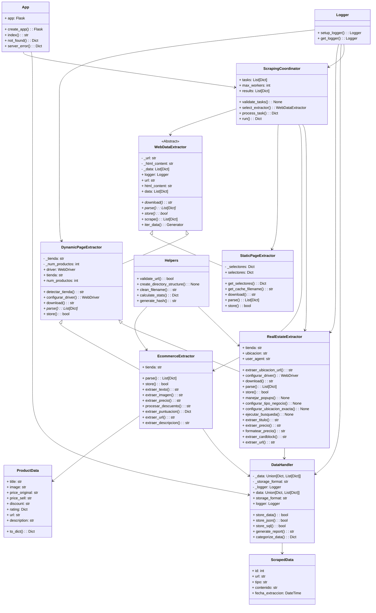

# 🌐 Sistema WebScrapping

## 🗒️ Colaboradores

```
├── Santiago Gamboa Martínez
├── Samuel Eduardo Fajardo Quintero
├── Alejandro Baca Torregroza
├── Alessandro Garzon Melo
├── Omar Daniel Calvache Madroñero
└── Nicolas David Lovera Cabiativa
```

# 🏆 Introducción

El volumen de información que se encuentra disponible en internet crece de manera exponencial, haciendo indispensable el uso de herramientas tecnológicas que permitan extraer y analizar datos relevantes de forma automática y eficiente. Por esta razón, como equipo, hemos elegido desarrollar la decidido crear un **_Sistema de WebScrapping_**, este proyecto consiste en desarrollar e implementar un sistema de web scraping que no solo cumpla con los objetivos de extracción de datos, sino que también esté diseñado aplicando principios fundamentales de la Programación Orientada a Objetos (POO) y optimizado bajo los principios del manejo de estructuras de datos.

El objetivo principal es garantizar una gestión eficiente de la información mediante la integración de dos componentes: Python y Java. Python se encargará de la navegación y extracción de datos desde plataformas de e-commerce, mientras que Java funcionará como el núcleo de procesamiento, enlazando los datos obtenidos con la interfaz gráfica (GUI). Para lograr un manejo y análisis rápidos, Java organizará la información en estructuras de datos en memoria —como arreglos dinámicos, árboles binarios y heaps— aprovechando las fortalezas de cada una para optimizar el rendimiento y la funcionalidad del sistema.

### Ventajas de este enfoque, centrado en ED:

- Eficiencia en Memoria: Java gestiona los objetos *Productos* en memoria, permitiendo manipulaciones rápidas sin depender de constantes lecturas al disco.
- Organización Lógica: Los datos no son simples cadenas de texto; se estructuran en colecciones dinamicas o lo mismo *ArrayList*; preparadas para ser integradas con estructuras más complejas como BST o Heaps para ordenamiento por precio o calificación.
- Interoperabilidad: Uso de *ProccesBuilder* y flujos de entrada/salida para comunicar dos entornos de programación distintos.


# 🗂️ Requerimientos Técnicos

## 1. Lenguaje y Librerías

- Python se va a encargar de ser el motor de scraping subyacente.
- Java será el lenguaje principar para la logica de negocio y estructuras de datos.

### Librerías Utilizadas

A continuación, se listan las librerías clave utilizadas en este proyecto, junto con una breve descripción de su funcionalidad:

```
PYTHON
Flask                # Desarrollo de aplicaciones web y creación de APIs
SQLAlchemy           # Manejo de bases de datos ORM para facilitar la interacción con datos estructurados
requests            # Realizar solicitudes HTTP de manera sencilla y eficiente
beautifulsoup4      # Parsear y extraer datos de estructuras HTML y XML
selenium            # Automatización e interacción con páginas web dinámicas
python-dotenv       # Gestión de variables de entorno para mayor seguridad y flexibilidad
colorama            # Mejorar la visualización de mensajes en la terminal con colores

JAVA
util.ArrayList      # Estructura base para el historial de productos
lang.ProcessBuilder # Para la orquestación y ejecución del script de Python
util.regex          # Para el parseo y limpieza de la información entrante (JSON strings)
```

## 2. Estructura del Código

Para garantizar escalabilidad y facilidad de mantenimiento, el código sigue los principios de **Programación Orientada a Objetos (POO)**. Esto permite la reutilización de componentes y una mejor organización del sistema.

### Clases principales

#### PYTHON
- **```WebDataExtractor```**: Clase base que define la estructura general del proceso de extracción de datos.
- **```StaticPageExtractor```**: Extiende `WebDataExtractor` para manejar páginas web estáticas.
- **```DynamicPageExtractor```**: Extiende `WebDataExtractor` para manejar páginas web dinámicas con `Selenium`.
- **```DataHandler```**: Responsable del almacenamiento y procesamiento de los datos extraídos.
- **```ScrapingCoordinator```**: Coordina la ejecución del proceso de scraping y gestiona las diferentes clases.
  
Por otra parte, para garantizar la gestión eficiente de estructuras de datos y en la conexión directa con la interfaz gráfica. Java actúa como el núcleo de procesamiento del sistema: recibe los datos generados por los módulos de Python, los transforma y los organiza en estructuras internas optimizadas.

### Archivos principales

#### JAVA
- **```App.Java```**: Main class, dirige las llamadas al scraper y muestra estadísticas acumuladas.
- **```DataManager.java```**: El puente, ejecuta el proceso de Python, captura el jlujo de datos (stdout), limpia los JSON strings y puebla las estructuras de datos en Java
- **```Producto.java```**: El nodo de información, representa el objeto con atributos normalizados
- **```RunPython.java```**: Encapsula la complejidad de invocar el intérprete de Python y gestionar los argumentos de entrada/salida

Cada uno de estos componentes está diseñado para manejar su propia funcionalidad: los módulos en Python se enfocan en la extracción y preparación de datos, mientras que los módulos en Java gestionan las estructuras internas y la interacción con la interfaz gráfica. Esta separación clara de responsabilidades reduce la dependencia entre módulos y facilita la escalabilidad y la extensión del sistema en el futuro.

## 3. Entorno de Desarrollo

Para asegurar una experiencia de desarrollo eficiente y organizada, se establecen las siguientes prácticas:

- **Uso de entornos virtuales (`venv`)**: Permite aislar dependencias y evitar conflictos con otras instalaciones de Python.
- **Control de versiones con `Git`**: Se emplea `Git` para rastrear cambios en el código, facilitar la colaboración y garantizar la estabilidad del proyecto.
- **Definición de dependencias en `requirements.txt`**: Se listan todas las librerías requeridas para que el entorno pueda ser replicado fácilmente en diferentes sistemas.
- **Uso de archivos de configuración (`.env`)**: Permite almacenar credenciales y configuraciones sensibles sin exponerlas en el código fuente.

## 4. Flujo de Datos y Estructuras

1. **Solicitud**: Java solicita datos.
2. **Extracción**: Python navega y extrae.
3. **Transmisión**: Los datos viajan vía stdout en formato string/JSON.
4. **Estructuración**: Java recibe los bytes, reconstruye los objetos **Producto** y los inserta en un **Historial Global** (`ArrayList`).
5. **Manipulación**: Los datos en la estructura permiten:
   - Filtrado por tienda.
   - Conversión de precios para futuros ordenamientos.
   - Generación de reportes acumulativos.

Los datos extraídos pueden ser almacenados en múltiples formatos según las necesidades del proyecto:

- **CSV**: Para manipulación en hojas de cálculo.
- **JSON**: Para intercambio de datos estructurados.
- **SQLite**: Para almacenamiento en bases de datos locales y consultas estructuradas.

El sistema está diseñado para adaptarse a diferentes formatos sin modificar la lógica central del scraping.

### Estructuras de datos utilizadas en Java

Además del flujo anterior, la capa de Java organiza los objetos **Producto** en varias estructuras de datos para permitir diferentes tipos de consultas:

- **`ArrayList<Producto>` – Historial global**  
  Es la primera estructura que se llena con los productos provenientes de Python.  
  Desde este historial:
  - Se reconstruyen las demás estructuras al iniciar el programa.
  - Se calculan estadísticas generales (cantidad total de productos, conteo por tienda, etc.).
  - Se muestran listados completos en la interfaz de consola.

- **Árbol AVL – Búsqueda por nombre de producto**  
  Los productos se insertan en un árbol AVL utilizando como clave el **título normalizado** (sin tildes y en minúsculas).  
  Esto permite:
  - Buscar productos por término de texto en tiempo cercano a `O(log n)`.
  - Recorrer el árbol en orden alfabético para mostrar los nombres ordenados.
  - Obtener subconjuntos de productos que coinciden con una palabra clave para luego analizarlos con otras estructuras (Heap o BST).

- **Heap mínimo – Top N productos más baratos**  
  A partir del historial o de un subconjunto filtrado, se construye un *heap* mínimo utilizando como clave el **precio numérico** del producto.  
  Con esta estructura se puede:
  - Obtener el **top N productos más baratos** sin ordenar toda la lista.
  - Comparar la eficiencia del Heap frente a ordenar el arreglo completo cada vez que se hace una consulta.

- **Árbol binario de búsqueda (BST) – Búsqueda por rango de precios**  
  También se inserta cada producto en un BST, donde la clave es nuevamente el precio.  
  El BST se utiliza para responder consultas como:
  - “Mostrar todos los productos con precio entre A y B”.
  - Recorrer solo los nodos cuyo precio está en el rango `[precioMin, precioMax]`, evitando revisar todos los elementos del historial.  
  Esto hace que las **consultas por rango** sean más eficientes y mejor estructuradas.

Gracias a la combinación de estas estructuras, el sistema no solo almacena los datos extraídos, sino que también permite realizar operaciones de búsqueda, filtrado y análisis de forma eficiente, que es uno de los objetivos principales del proyecto en el contexto de Estructuras de Datos.

## 5. Otros Requerimientos y Consideraciones

- **Manejo de excepciones**: Se implementan mecanismos de captura de errores para evitar interrupciones inesperadas en la ejecución del programa.
- **Compatibilidad con múltiples tipos de sitios web**: El sistema está diseñado para funcionar con páginas estáticas y dinámicas.
- **Optimización del rendimiento**: Se evalúan estrategias como el uso de `asyncio` y `multithreading` para mejorar la eficiencia en el scraping.
- **Escalabilidad**: La arquitectura modular permite agregar nuevas fuentes de datos o expandir funcionalidades sin afectar la estructura existente.

Este conjunto de prácticas y herramientas asegura un flujo de trabajo robusto y adaptable a diferentes necesidades del proyecto.

# 🛠️ Configuración del Entorno de Trabajo

### **1. Clonar el repositorio**:

Descargar el código fuente con los siguientes comandos:

```bash
git clone https://github.com/santgm56/SCDataExtractor_Project.git
cd Super-Proyecto-Final
```

### **2. Crear y activar un entorno virtual**:

El uso de un entorno virtual ayuda a instalar las dependencias del proyecto sin interferir con otras aplicaciones de Python.

**En Windows**:

```bash
python -m venv venv
.\venv\Scripts\activate
```

**En macOS/Linux**:

```bash
python -m venv venv
source venv/bin/activate
```

### **3. Instalar las dependencias**:

Una vez dentro del entorno virtual, ejecutar:

```bash
pip install -r requirements.txt
```
### **4. Compilar y Ejecutar Java:**

El punto de entrada es ahora Java. Asegúrarse de estar en la raíz del proyecto es importante.

```bash
javac -d bin SCDataExtractor_Project/App/src/*.java

# Ejecutar la aplicación
java -cp bin App
```

### **5. Salir del entorno virtual**:

Al terminar de trabajar o hacer modificaciones, se puede salir del entorno virtual escribiendo:

```bash
deativate
```

Si se usa Windows y existe algún problema al activar el entorno virtual, es posible que se necesite habilitar la ejecución de scripts por políticas de resticción en powershell. Para corregirlo, basta con ejecutar estos comandos en el CMD como terminal predeterminada ya que esta no cuenta con dichas condiciones.


# ✨ Estructura del proyecto

```plaintext
SUPER_PROYECTO_FINAL/
├── README.md
├── Estructura_Proyecto.txt
├── main.py
├── requirements.txt
├── setup.py
├── App/                             # Módulo Java (estructuras de datos)
│   ├── README.md
│   ├── compile.ps1                  # Script para compilar en Windows
│   ├── run.ps1                      # Script para ejecutar en Windows
│   ├── setup.ps1                    # Configuración inicial del módulo Java
│   ├── .vscode/
│   │   └── settings.json            # Configuración del editor
│   ├── docs/
│   │   ├── ARQUITECTURA.md          # Detalles de arquitectura del módulo Java
│   │   ├── DESARROLLO.md            # Notas de desarrollo
│   │   └── INSTALACION.md           # Guía de instalación (Java)
│   └── src/
│       ├── App.java                 # Main Java – interfaz de consola
│       ├── AVLTree.java             # Implementación del Árbol AVL
│       ├── BST.java                 # Árbol binario de búsqueda (rangos de precio)
│       ├── DataManager.java         # Gestor del historial y de las ED
│       ├── Heap.java                # Heap mínimo (top N productos más baratos)
│       ├── HistorialDB.java         # Manejo de la base de datos de historial
│       ├── Producto.java            # Modelo de producto
│       └── RunPython.java           # Ejecutor de Python via ProcessBuilder
├── src/                             # Módulo Python (scraping + API + BD)
│   ├── __init__.py
│   ├── config.py                    # Configuración general y selectores
│   ├── base/
│   │   ├── __init__.py
│   │   └── web_data_extractor.py    # Clase base WebDataExtractor
│   ├── components/
│   │   ├── __init__.py
│   │   ├── data_handler.py          # Almacenamiento en JSON/SQLite y reportes
│   │   └── dynamic/
│   │       ├── __init__.py
│   │       ├── dynamic_page_extractor.py # Base para scrapers dinámicos (Selenium)
│   │       ├── ecommerce_extractor.py    # Scraper de e-commerce
│   │  
│   ├── coordinator/
│   │   ├── __init__.py
│   │   └── scraping_coordinator.py  # Coordinador de tareas de scraping
│   ├── db/
│   │   ├── __init__.py
│   │   ├── database.py              # Conexión a SQLite mediante SQLAlchemy
│   │   └── models.py                # Definición de modelos ORM
│   ├── utils/
│   │   ├── __init__.py
│   │   ├── helpers.py               # Funciones auxiliares (validación, paths, etc.)
│   │   └── logger.py                # Configuración de logging
│   └── web/
│       ├── __init__.py
│       ├── app.py                   # Creación de la app Flask
│       └── routes.py                # Rutas de la API REST
├── logs/
│   ├── .gitkeep                     # Placeholder para el directorio
│   └── scraping.log                 # Registro de ejecución del scraping
└── outputs/
    └── scraped_data.db              # Base de datos SQLite con los datos extraídos
```

El proyecto está organizado de manera modular y jerárquica, siguiendo buenas prácticas de desarrollo de software. A continuación, se explica cada componente y su importancia, así como las ventajas de utilizar esta estructura:

### **1. Archivos Raíz**
- **`README.md`**:  
  - **Importancia**: Es la primera impresión del proyecto. Proporciona una descripción general, instrucciones de instalación, uso y documentación clave.  
  - **Ventajas**: Facilita la comprensión del proyecto para nuevos desarrolladores o colaboradores. Es esencial para proyectos open-source o colaborativos.  

- **`requirements.txt`**:  
  - **Importancia**: Lista todas las dependencias necesarias para ejecutar el proyecto.  
  - **Ventajas**: Permite replicar el entorno de desarrollo fácilmente con `pip install -r requirements.txt`. Asegura que todos los colaboradores usen las mismas versiones de las librerías.  

- **`.gitignore`**:  
  - **Importancia**: Especifica archivos y directorios que no deben ser rastreados por Git (por ejemplo, `__pycache__`, `logs/`, `outputs/`).  
  - **Ventajas**: Evita la inclusión de archivos innecesarios en el repositorio, como archivos temporales o datos sensibles.  

- **`setup.py`**:  
  - **Importancia**: Script para instalar el proyecto y sus dependencias. Puede incluir metadatos y configuraciones de instalación.  
  - **Ventajas**: Facilita la distribución e instalación del proyecto como un paquete Python.  

- **`main.py`**:  
  - **Importancia**: Punto de entrada principal del scraper. Contiene la lógica para iniciar el proceso de scraping.  
  - **Ventajas**: Centraliza la ejecución del proyecto, lo que simplifica la interacción con el usuario final.  

### **2. Directorio `App/` (Módulo Java - Estructuras de Datos)**
Este directorio contiene el núcleo lógico y de gestión de datos del proyecto, implementado en Java para aprovechar su tipado fuerte y eficiencia en memoria.

### 2. Directorio `App/` (Módulo Java – Estructuras de Datos)

Este directorio contiene el núcleo lógico y de gestión de datos del proyecto, implementado en Java para aprovechar su tipado fuerte y eficiencia en memoria.

#### 2.1. `src/` (Código fuente Java)

**App.java**  
- **Importancia**: Es el punto de entrada principal del sistema en Java. Orquesta la ejecución, mostrando menús, opciones de scraping y estadísticas acumuladas.  
- **Ventajas**: Centraliza el flujo del programa y la interacción con el usuario desde un entorno robusto.

**DataManager.java**  
- **Importancia**: Actúa como el “cerebro” de la gestión de datos. Parsea la salida de Python y puebla las estructuras de datos en memoria (historial y estructuras auxiliares).  
- **Ventajas**: Permite manipular, filtrar y acumular datos de múltiples búsquedas sin depender constantemente del acceso a disco.

**Producto.java**  
- **Importancia**: Define el modelo de datos (objeto/nodo) para cada producto. Normaliza atributos como el precio (de texto a numérico) y el título (tildes, mayúsculas, etc.).  
- **Ventajas**: Garantiza la integridad de la información y facilita la implementación de algoritmos de búsqueda y ordenamiento.

**RunPython.java**  
- **Importancia**: Gestiona la interoperabilidad entre Java y Python mediante `ProcessBuilder`, ejecutando `main.py` dentro del entorno virtual.  
- **Ventajas**: Encapsula la complejidad de ejecutar subprocesos, manejar stdin/stdout y capturar errores del script de scraping.

#### 2.2. Clases de estructuras de datos en Java

**AVLTree.java**  
- **Importancia**: Implementa un Árbol AVL que mantiene los productos ordenados por un criterio (por ejemplo, título normalizado).  
- **Ventajas**: Permite búsquedas y recorridos en orden alfabético en tiempo cercano a `O(log n)`.

**BST.java**  
- **Importancia**: Implementa un Árbol Binario de Búsqueda usando típicamente el precio como clave.  
- **Ventajas**: Facilita consultas por rango de precios (por ejemplo, productos entre A y B) sin recorrer todos los elementos.

**Heap.java**  
- **Importancia**: Implementa un Heap mínimo a partir del precio numérico del producto.  
- **Ventajas**: Permite obtener el “Top N productos más baratos” de forma eficiente, sin ordenar toda la lista cada vez.

**HistorialDB.java**  
- **Importancia**: Gestiona el almacenamiento del historial de productos en una base de datos (lado Java).  
- **Ventajas**: Permite persistir la información entre ejecuciones y reconstruir las estructuras de datos en memoria al iniciar el programa.

---

### **3. Directorio `src/` (Código Fuente Python)**  
Este directorio contiene el núcleo del proyecto, organizado en módulos y subdirectorios específicos.  

#### **3.1. `config.py`**  
- **Importancia**: Centraliza la configuración del proyecto (por ejemplo, timeouts, selectores CSS, credenciales de API).  
- **Ventajas**: Facilita la modificación de parámetros sin necesidad de alterar el código fuente. Mejora la mantenibilidad.  

#### **3.2. `base/`**  
- **Importancia**: Contiene la clase base abstracta `web_data_extractor.py`, que define la interfaz común para todos los extractores.  
- **Ventajas**: Promueve la reutilización de código y asegura que todos los extractores sigan un patrón común (herencia y polimorfismo).  

#### **3.3. `components/`**  
- **Importancia**: Contiene los módulos específicos para el scraping, divididos en:  
  - **`static_page_extractor.py`**: Extracción de páginas estáticas (HTML/CSS).  
  - **`dynamic/`**: Extracción de páginas dinámicas (JavaScript), con módulos específicos para e-commerce y bienes raíces.  
  - **`data_handler.py`**: Manejo de datos extraídos (JSON, SQL).  
- **Ventajas**: La modularidad permite agregar nuevos tipos de extractores sin afectar el código existente. Facilita las pruebas y el mantenimiento.  

#### **3.4. `coordinator/`**  
- **Importancia**: Contiene `scraping_coordinator.py`, que gestiona el flujo de trabajo del scraping (descarga, extracción y almacenamiento).  
- **Ventajas**: Centraliza la lógica de coordinación, lo que simplifica la ejecución de tareas complejas y mejora la escalabilidad.  

#### **3.5. `utils/`**  
- **Importancia**: Proporciona funciones auxiliares, como validación de URLs (`helpers.py`) y configuración de logging (`logger.py`).  
- **Ventajas**: Promueve la reutilización de código y reduce la duplicación. Facilita la depuración y el monitoreo del proyecto.  

#### **3.6. `db/`**  
- **Importancia**: Contiene los modelos de base de datos (`models.py`) y la configuración de la conexión (`database.py`).  
- **Ventajas**: Separa la lógica de acceso a datos del resto del código, lo que facilita la migración a otros sistemas de bases de datos.  

#### **3.7. `web/`**  
- **Importancia**: Implementa la API RESTful usando Flask (`app.py`, `routes.py`) y los archivos estáticos (`templates/`, `static/`).  
- **Ventajas**: Permite exponer los datos scrapeados a través de una interfaz web, lo que facilita la integración con otros sistemas.  

---

### **4. Directorio `tests/`**  
- **Importancia**: Contiene pruebas automatizadas para cada módulo del proyecto (`test_modules.py`) y configuraciones comunes (`conftest.py`).  
- **Ventajas**: Asegura la calidad del código y detecta errores temprano. Facilita la refactorización y el mantenimiento.  

---

### **5. Directorio `logs/`**  
- **Importancia**: Almacena archivos de registro (`scraping.log`) que documentan la actividad del scraper.  
- **Ventajas**: Facilita la depuración y el monitoreo del sistema en producción.  

---

### **6. Directorio `outputs/`**  
- **Importancia**: Contiene los resultados del scraping en formato JSON o SQL.  
- **Ventajas**: Centraliza los datos extraídos, lo que facilita su análisis y uso posterior.  

---

### **7. Directorio `static/`**  
- **Importancia**: Almacena archivos estáticos (CSS, JS, imágenes) para la interfaz web.  
- **Ventajas**: Separa el contenido estático del código dinámico, lo que mejora el rendimiento y la organización.  

---

### **Ventajas Generales de la Estructura**
1. **Modularidad**: Cada componente tiene una responsabilidad clara, lo que facilita la escalabilidad y el mantenimiento.  
2. **Reutilización de Código**: Funciones comunes (por ejemplo, logging, manejo de datos) están centralizadas en módulos reutilizables.  
3. **Claridad y Organización**: La estructura jerárquica y los nombres descriptivos hacen que el proyecto sea fácil de entender y navegar.  
4. **Escalabilidad**: Nuevos módulos (por ejemplo, extractores para otros sitios) pueden agregarse sin afectar el código existente.  
5. **Colaboración**: Facilita el trabajo en equipo al separar responsabilidades y proporcionar una estructura clara.  
6. **Pruebas y Depuración**: Las pruebas automatizadas y los logs mejoran la calidad del código y simplifican la detección de errores.  

# 📈 Diagrama de Clases 



# ⛅ Relaciones en el Diagrama de Clases 

## 1. Herencia (Relación "es un")  
### Descripción  
Indica que una clase es una especialización de otra. La clase hija hereda atributos y métodos de la clase padre.  

### Relaciones  
- **WebDataExtractor → StaticPageExtractor:**  
  - `StaticPageExtractor` es una especialización de `WebDataExtractor` para manejar sitios estáticos (HTML/CSS).  
  - Hereda métodos como `download()`, `parse()` y `store()`, pero los implementa de manera específica para páginas estáticas.  
 
- **WebDataExtractor → DynamicPageExtractor:**  
  - `DynamicPageExtractor` es una especialización de `WebDataExtractor` para manejar sitios dinámicos (JavaScript).  
  - Hereda métodos como `download()`, `parse()` y `store()`, pero los implementa usando Selenium para interactuar con contenido dinámico.  

- **DynamicPageExtractor → EcommerceExtractor:**  
  - `EcommerceExtractor` es una especialización de `DynamicPageExtractor` para manejar sitios de e-commerce (por ejemplo, MercadoLibre, Alkosto).  
  - Implementa métodos específicos para extraer datos de productos, como precios, imágenes y descripciones.  

- **DynamicPageExtractor → RealEstateExtractor:**  
  - `RealEstateExtractor` es una especialización de `DynamicPageExtractor` para manejar sitios de bienes raíces (por ejemplo, Metrocuadrado).  
  - Implementa métodos específicos para extraer datos de propiedades, como precios, áreas y ubicaciones.  

---

## 2. Composición (Relación "tiene un")  
### Descripción  
Indica que una clase está compuesta por otras clases. La clase contenedora depende de las clases que la componen.  

### Relaciones  
- **EcommerceExtractor → ProductData:**  
  - `EcommerceExtractor` utiliza `ProductData` para representar los datos de un producto (por ejemplo, título, precio, imagen).  
  - `ProductData` es una clase auxiliar que encapsula la estructura de los datos de un producto.  

- **EcommerceExtractor → DataHandler:**  
  - `EcommerceExtractor` utiliza `DataHandler` para almacenar los datos extraídos en JSON o SQL.  

- **RealEstateExtractor → DataHandler:**  
  - `RealEstateExtractor` utiliza `DataHandler` para almacenar los datos extraídos en JSON o SQL.  

- **ScrapingCoordinator → StaticPageExtractor, EcommerceExtractor, RealEstateExtractor:**  
  - `ScrapingCoordinator` utiliza estas clases para ejecutar tareas de scraping.  
  - Coordina la ejecución de múltiples tareas, seleccionando el extractor adecuado para cada URL.  

---

## 3. Asociación (Relación "usa")  
### Descripción  
Indica que una clase utiliza otra clase para realizar una tarea específica, pero no hay una dependencia fuerte entre ellas.  

### Relaciones  
- **DataHandler → ScrapedData:**  
  - `DataHandler` utiliza `ScrapedData` para almacenar los datos extraídos en la base de datos.  
  - `ScrapedData` es un modelo de base de datos que representa los datos scrapeados.  

- **App → ScrapingCoordinator:**  
  - `App` utiliza `ScrapingCoordinator` para gestionar las tareas de scraping.  
  - `ScrapingCoordinator` es responsable de ejecutar las tareas y devolver los resultados.  

- **App → DataHandler:**  
  - `App` utiliza `DataHandler` para acceder a los datos almacenados y mostrarlos a través de la API.  

---

## 4. Dependencia de Utilidades (Relación "usa")  
### Descripción  
Indica que una clase depende de una clase de utilidad para realizar tareas específicas.  

### Relaciones  
- **DynamicPageExtractor, RealEstateExtractor, DataHandler, ScrapingCoordinator → Logger:**  
  - Estas clases utilizan `Logger` para registrar eventos, errores y actividades durante la ejecución del scraping.  
  - `Logger` es una clase de utilidad que centraliza la configuración de logging.  

- **EcommerceExtractor, RealEstateExtractor → Helpers:**  
  - Estas clases utilizan `Helpers` para realizar tareas comunes, como validar URLs, limpiar nombres de archivos y generar hashes.  
  - `Helpers` es una clase de utilidad que proporciona funciones auxiliares.  

---

## 5. Relación entre ScrapedData y DataHandler  
### Descripción  
`DataHandler` utiliza `ScrapedData` para almacenar los datos extraídos en la base de datos.  

### Cómo se afectan  
- `DataHandler` toma los datos extraídos por los extractores (`StaticPageExtractor`, `EcommerceExtractor`, `RealEstateExtractor`) y los convierte en instancias de `ScrapedData`.  
- `ScrapedData` es un modelo de base de datos que define la estructura de los datos almacenados (por ejemplo, URL, tipo de datos, contenido, fecha de extracción).  

---

## 6. Relación entre App y ScrapingCoordinator/DataHandler  
### Descripción  
`App` utiliza `ScrapingCoordinator` y `DataHandler` para gestionar la API y las tareas de scraping.  

### Cómo se afectan  
- `App` expone una API RESTful que permite a los usuarios iniciar tareas de scraping y consultar los datos almacenados.  
- `ScrapingCoordinator` ejecuta las tareas de scraping y devuelve los resultados a `App`.  
- `DataHandler` proporciona acceso a los datos almacenados, que `App` devuelve como respuestas de la API.  

---

# 💎 **Utilidades**

## Módulo `Logger`
El módulo `Logger` gestiona el registro de eventos en la aplicación mediante el módulo `logging` de Python, permitiendo un rastreo flexible. Se integra con `os` para la gestión de directorios y `typing` para mejorar la claridad del código.

### 1. Configuración del Logger (`setup_logger`)
- **Propósito**: Configura el logger con handlers para archivo y consola.
- **Funcionalidades**:
  - Define el nivel de logging (`INFO`, `DEBUG`).
  - Elimina handlers duplicados.
  - Crea el directorio de logs si no existe.
  - Establece un formato estándar para los logs.
  - Configura un handler de archivo rotativo (10 MB, 5 respaldos).
  - Agrega un handler de consola opcional.
  - Suprime logs de Selenium para evitar ruido.

```python
def setup_logger(config: Dict[str, Any]) -> logging.Logger:
    """Configura el logger raíz con handlers para archivo y consola"""
    logger = logging.getLogger()
    logger.setLevel(config.get('level', 'INFO').upper())

    for handler in logger.handlers[:]:
        logger.removeHandler(handler)

    os.makedirs(config.get('log_dir', 'logs'), exist_ok=True)

    formatter = logging.Formatter(
        '%(asctime)s - %(name)s - %(levelname)s - %(message)s',
        datefmt='%Y-%m-%d %H:%M:%S'
    )

    file_handler = RotatingFileHandler(
        filename=os.path.join(config.get('log_dir', 'logs'), 'scraping.log'),
        maxBytes=10*1024*1024,  
        backupCount=5,
        encoding='utf-8'
    )
    file_handler.setFormatter(formatter)
    logger.addHandler(file_handler)

    if config.get('enable_console', True):
        console_handler = logging.StreamHandler()
        console_handler.setFormatter(formatter)
        logger.addHandler(console_handler)
        
    logging.getLogger("selenium").setLevel(logging.WARNING)

    return logger
```
## 2. Obtención del Logger (`get_logger`)

### Propósito
Retorna un logger configurado o uno básico si `setup_logger` no se ha ejecutado.

### Funcionalidades
- Crea un logger básico con handler de consola si no hay configuraciones previas.
- Establece `INFO` como nivel de logging predeterminado.

```python
def get_logger(name: str = None) -> logging.Logger:
    """Obtiene un logger configurado o un logger básico si setup_logger no se ejecutó."""
    logger = logging.getLogger(name or "ScrapingLogger")

    if not logger.hasHandlers():
        handler = logging.StreamHandler()
        formatter = logging.Formatter('%(asctime)s - %(levelname)s - %(message)s')
        handler.setFormatter(formatter)
        logger.addHandler(handler)
        logger.setLevel(logging.INFO)

    return logger
```

# **Módulo `Helpers`**  
El módulo `Helpers` proporciona funciones auxiliares esenciales para el proyecto, incluyendo validación de URLs, gestión de directorios, limpieza de nombres de archivos, cálculo de estadísticas y generación de hashes.  

## **Lógica del Código**  

### **1. Validación de URLs (`validate_url`)**
- **Propósito**: Verifica si una URL tiene un formato válido.
- **Funcionalidad**: Usa una expresión regular para validar el protocolo, dominio, puerto opcional y ruta opcional.

```python
def validate_url(url: str) -> bool:
    """Valida que una URL tenga formato correcto"""
    regex = re.compile(r'^(https?://)?(([A-Z0-9-]+\.)+[A-Z]{2,63})(:\d+)?(/.*)?$', re.IGNORECASE)
    return re.match(regex, url) is not None
```
## 2. Creación de Directorios (`create_directory_structure`)

**Propósito**: Crea la estructura de directorios para almacenar los resultados del scraping.  
**Funcionalidad**: Usa `os.makedirs` para crear los directorios si no existen.  

```python
def create_directory_structure(base_path: str = "outputs") -> None:
    """Crea la estructura de directorios necesaria"""
    directories = [
        base_path,
        os.path.join(base_path, "static_pages_extractors"),
        os.path.join(base_path, "dynamic_extractors", "e-commerce"),
        os.path.join(base_path, "dynamic_extractors", "real_state"),
        "logs"
    ]
    for directory in directories:
        os.makedirs(directory, exist_ok=True)
```
## 3. Limpieza de Nombres de Archivos (`clean_filename`)

**Propósito**: Asegura que los nombres de archivos sean válidos en todos los sistemas.  
**Funcionalidad**: Elimina caracteres especiales y espacios innecesarios.  

```python
def clean_filename(filename: str, max_length: int = 100) -> str:
    """Limpia un nombre de archivo para hacerlo válido en todos los sistemas"""
    cleaned = re.sub(r'[\\/*?:"<>|]', "_", filename.strip())
    cleaned = re.sub(r'_{2,}', '_', cleaned)
    return cleaned[:max_length].strip('_')
```
## 4. Cálculo de Estadísticas (`calculate_stats`)

**Propósito**: Obtiene métricas sobre los resultados del scraping.  
**Funcionalidad**:  
- Cuenta éxitos y errores.  
- Calcula tasas de éxito y error.  
- Agrupa errores por tipo.  

```python
def calculate_stats(results: List[Dict]) -> Dict[str, Union[int, float]]:
    """Calcula estadísticas de los resultados del scraping"""
    stats = {'total': len(results), 'success': 0, 'errors': 0, 'error_types': {}, 'avg_time': 0.0}
    
    for result in results:
        if 'error' in result:
            stats['errors'] += 1
            error_type = result['error'].split(':')[0]
            stats['error_types'][error_type] = stats['error_types'].get(error_type, 0) + 1
        else:
            stats['success'] += 1

    if stats['total'] > 0:
        stats['success_rate'] = (stats['success'] / stats['total']) * 100
        stats['error_rate'] = (stats['errors'] / stats['total']) * 100
    
    return stats
```
## 5. Generación de Hash (`generate_hash`)

**Propósito**: Crea un identificador único para un contenido.  
**Funcionalidad**: Usa el algoritmo MD5 y retorna los primeros `length` caracteres del hash.  

```python
def generate_hash(content: str, length: int = 8) -> str:
    """Genera un hash único para contenido"""
    return hashlib.md5(content.encode()).hexdigest()[:length]
```
# 📜 **Clase Base**

## **WebDataExtractor**

La clase `WebDataExtractor` es una **clase abstracta** que define la interfaz y el flujo base para la extracción de datos de páginas web. Establece un proceso estándar de scraping que incluye:

1. Descargar el contenido HTML.
2. Parsear la información relevante.
3. Almacenar los datos extraídos.

Las clases hijas (por ejemplo, `StaticPageExtractor` y `DynamicPageExtractor`) implementan los métodos abstractos definidos aquí, pero siempre respetando este mismo flujo.

---

### Rol dentro del sistema y flujo de datos

`WebDataExtractor` es el **punto de partida del pipeline de datos** del proyecto. Su objetivo principal es garantizar que todos los extractores produzcan información **consistente** y fácil de reutilizar en el resto del sistema.

- Define un **contrato común** (`download()`, `parse()`, `store()`, `scrape()`) para cualquier extractor.
- Asegura que el resultado final sea una **lista de diccionarios** con una estructura homogénea, que:
  - `DataHandler` puede guardar en JSON o SQLite.
  - El módulo Java puede transformar en objetos `Producto` para cargarlos en estructuras de datos (`ArrayList`, `AVLTree`, `BST`, `Heap`).

Gracias a esto, es posible añadir nuevas fuentes de datos sin modificar la lógica de almacenamiento ni la lógica de consulta.

---

## **Métodos clave**

### 1. Métodos abstractos

#### `download(self)`
- Descarga el contenido HTML de la URL.
- La implementación concreta depende de la subclase (por ejemplo, `requests` para páginas estáticas o `Selenium` para páginas dinámicas).

#### `parse(self)`
- Parsea el HTML descargado y extrae la información deseada.
- Debe devolver **una lista de diccionarios** con una estructura consistente  
  (por ejemplo, `[{ "title": ..., "price": ..., "url": ... }, ...]`).

#### `store(self)`
- Almacena los datos extraídos en el formato configurado (JSON, base de datos SQLite, etc., normalmente a través de `DataHandler`).
- Devuelve `True` si el almacenamiento fue exitoso y `False` en caso contrario.

---

### 2. Métodos concretos

#### `scrape(self)`
- Orquesta el proceso completo de scraping:
  1. Llama a `download()` para obtener el HTML.
  2. Llama a `parse()` para construir la lista de diccionarios.
  3. Llama a `store()` para persistir los datos.
- Devuelve la lista de datos extraídos o `None` si ocurre un error.

#### `iter_data(self)`
- Generador que permite iterar sobre los datos extraídos.
- Útil para manejar grandes volúmenes de información sin cargar toda la lista en memoria de una sola vez.

---

## **Atributos clave**

- **`_url`**  
  URL objetivo a scrapear (privado). Se accede mediante la propiedad `url`.

- **`_html_content`**  
  Contenido HTML descargado (privado). Se accede mediante la propiedad `html_content`.

- **`_data`**  
  Lista de diccionarios con los datos extraídos (privado). Se accede mediante la propiedad `data`.

- **`logger`**  
  Manejador de logging utilizado para registrar eventos, advertencias y errores durante el proceso de scraping.

---

## **Ejemplo de uso**

```python
class StaticPageExtractor(WebDataExtractor):
    def download(self):
        # Implementación específica para páginas estáticas
        pass

    def parse(self):
        # Implementación específica para páginas estáticas
        pass

    def store(self):
        # Implementación específica para páginas estáticas
        pass

extractor = StaticPageExtractor("https://example.com")
data = extractor.scrape()  # Ejecuta el proceso completo de scraping
```
# 🛸 **Extractores**
## **`static_page_extractor.py`**

Implementa un extractor para páginas web **estáticas**, heredando de la clase abstracta `WebDataExtractor`.  
Este módulo se encarga de:

- **Descargar el contenido HTML** de páginas estáticas usando `requests`, con gestión de caché y reintentos (ver método `download()`).
- **Parsear el HTML** para extraer información estructurada (título, infobox, contenido, imágenes, listas y tablas) usando `BeautifulSoup` (ver método `parse()`).
- **Entregar los datos ya estructurados** como diccionarios, listos para ser almacenados por `DataHandler` en JSON y/o base de datos SQLite (ver método `store()`).
- **Personalizar selectores** y parámetros a través de un archivo de configuración (ver atributo `_selectores` y método `get_selectores()`).

### 🔁 Rol dentro del sistema y relación con los datos

- Es la **fuente principal de datos estructurados** para páginas estáticas (por ejemplo, Wikipedia y Fandom).
- Produce una **lista de diccionarios** con campos consistentes (por ejemplo, `title`, `infobox`, `content`), lo que facilita:
  - que `DataHandler` los guarde en JSON/SQLite sin conocer los detalles de cada sitio,
  - que estos registros puedan transformarse después en objetos de más alto nivel (por ejemplo, productos o entradas) y, eventualmente, cargarse en estructuras de datos en otros módulos.
- La lógica de caché evita descargas repetidas, reduciendo el tiempo de ejecución y el número de peticiones a los servidores de origen.

---

## **Dependencias**

- **Módulos principales**:
  - `hashlib`: para generar hashes únicos (ver método `get_cache_filename()`).
  - `json`: para manejar datos en formato JSON (ver método `store()`).
  - `os`: para interactuar con el sistema de archivos (ver método `get_cache_filename()`).
  - `requests`: para realizar solicitudes HTTP (ver método `download()`).
  - `time`: para manejar tiempos de espera y reintentos (ver método `download()`).
  - `BeautifulSoup`: para parsear HTML (ver método `parse()`).
  - `urllib.parse.urljoin`: para construir URLs absolutas (ver método `parse()`).

---

## **Fragmentos de Código Destacados**

### **1. Descarga con Caché**
```python
def download(self):
    cache_file = self.get_cache_filename()
    if self.url in CACHE:
        return CACHE[self.url]
    if os.path.exists(cache_file):
        with open(cache_file, "r", encoding="utf-8") as f:
            return f.read()
    # Lógica de descarga y almacenamiento en caché...
```
### **2. Descarga con Caché** 
```python def parse(self):
    soup = BeautifulSoup(self.html_content, 'html.parser')
    title = soup.find("h1").get_text(strip=True)  # Extrae el título
    infobox = self._extraer_infobox(soup)  # Extrae la infobox
    content = self._extraer_contenido(soup)  # Extrae el contenido
    return {"title": title, "infobox": infobox, "content": content}
 ```
### **3. Descarga con Caché** 
```python def store(self):
    handler = DataHandler(self.data, storage_format='both', logger=self.logger)
    return handler.store_data(url=self.url, tipo="static")
```
## **Módulo: `dynamic_page_extractor.py`**

Implementa un extractor base para páginas web **dinámicas**, heredando de la clase abstracta `WebDataExtractor`.  
Este módulo se encarga de:

- **Cargar páginas dinámicas** usando `Selenium WebDriver` en modo headless (ver método `download()`).
- **Esperar a que se renderice el contenido** dinámico antes de capturar el HTML (uso de `WebDriverWait` en `download()`).
- **Entregar el HTML resultante** para que las subclases (como `EcommerceExtractor` y `RealEstateExtractor`) lo procesen con `BeautifulSoup` (`parse()` en subclases).
- **Almacenar los datos extraídos** mediante `DataHandler` en JSON o en una base de datos SQLite (ver método `save_store()` / `store()`).

---

### 🔁 Rol dentro del sistema y relación con los datos

- Proporciona una **capa común para todas las páginas que requieren JavaScript** para mostrar su contenido (e-commerce, bienes raíces, etc.).
- Separa la lógica de:
  - configuración y apertura del navegador,
  - espera a que los elementos se carguen,
  - obtención del HTML dinámico,
de la lógica específica de parseo que implementan las subclases.
- Garantiza que, una vez parseado el HTML por las subclases, el resultado se convierta en **listas de diccionarios** coherentes, listas para:
  - ser almacenadas por `DataHandler` en JSON/SQLite,
  - ser utilizadas posteriormente por otros módulos (por ejemplo, transformadas a objetos `Producto` en Java y cargadas en estructuras de datos).

---

### **Dependencias**

- **`selenium`**: para automatizar la interacción con navegadores web (ver método `download()`).
- **`BeautifulSoup`**: para parsear el HTML resultante (en las subclases que implementan `parse()`).
- **`random`**: para seleccionar un agente de usuario aleatorio (inicialización de `USER_AGENT_DINAMICOS`).
- **`time`**: para manejar tiempos de espera y pausas en la carga (ver método `download()`).
- **`urllib.parse`**: para trabajar con URLs y detectar la tienda (ver método `detectar_tienda()`).

---

### **Clase principal: `DynamicPageExtractor`**

#### **Atributos**

- **`_tienda`**: tipo de tienda detectada (por ejemplo `"mercadolibre"`, `"alkosto"`) (ver método `detectar_tienda()`).
- **`_num_productos`**: número de productos a extraer (ver propiedad `num_productos`).
- **`driver`**: instancia de `Selenium WebDriver` utilizada para cargar la página (ver método `configurar_driver()`).

#### **Métodos**

- **`download()`**: descarga el contenido dinámico usando Selenium (abre la página, espera a que cargue el DOM y devuelve el HTML).
- **`parse()`**: método abstracto; las subclases lo implementan para extraer datos específicos del HTML.
- **`save_store()` / `store()`**: delegan el almacenamiento de los datos extraídos en `DataHandler`, permitiendo guardar en JSON y/o SQLite con el tipo `"dynamic"`.
- **`detectar_tienda()`**: detecta la tienda basada en el dominio de la URL para adaptar la configuración.
- **`configurar_driver()`**: configura el WebDriver (modo headless, user-agent, etc.) antes de realizar la descarga.

---

### **Ejemplo de uso**

```python
extractor = DynamicPageExtractor("https://www.mercadolibre.com.co")
extractor.download()        # Descarga el contenido dinámico
data = extractor.parse()    # Parsea el HTML (implementado en subclases)
extractor.save_store()      # Almacena los datos
```
### **Descarga con Selenium**
```python 
def download(self):
    opciones = Options()
    opciones.add_argument("--headless=new")  # Modo headless
    opciones.add_argument(f"user-agent={random.choice(USER_AGENT_DINAMICOS)}")
    driver = webdriver.Chrome(options=opciones)
    driver.get(self.url)
    WebDriverWait(driver, 10).until(EC.presence_of_element_located((By.TAG_NAME, "body")))
    return driver.page_source
```

### **Detección de Tienda**
```python
def detectar_tienda(self):
    dominio = urlparse(self.url).netloc.lower()
    for tienda, dominios in dominios_tiendas.items():
        if any(subdominio in dominio for subdominio in dominios):
            return tienda
    raise ValueError(f"No se reconoce la tienda para el dominio: {dominio}")
```
### **Almacenamiento de Datos**
```python   def save_store(self):
    handler = DataHandler(self.data, storage_format='both', logger=self.logger)
    return handler.store_data(url=self.url, tipo="dynamic")
```
## **Módulo: `ecommerce_extractor.py`**

Implementa un extractor de datos para páginas web dinámicas de **e-commerce**, como MercadoLibre y Alkosto. Utiliza `Selenium` para renderizar el contenido dinámico y `BeautifulSoup` para parsear el HTML. Este módulo permite extraer información estructurada de productos, como títulos, precios, imágenes, descuentos y descripciones.

### **Características principales**

- **Paginación automática**: navega por múltiples páginas de resultados.
- **Manejo de errores robusto**: reintentos y logging detallado.
- **Almacenamiento flexible**: guarda datos en JSON o en base de datos SQLite (a través de `DataHandler`).

---

### 🔁 Rol dentro del sistema y relación con los datos

- Especializa el comportamiento de `DynamicPageExtractor` para sitios de **e-commerce**, transformando el HTML dinámico en registros de productos con una estructura uniforme.
- Utiliza la clase `ProductData` para organizar los campos de cada producto (título, precio, imagen, descuento, rating, URL, descripción) y luego convertirlos a **diccionarios** mediante `to_dict()`.
- Genera una **lista de diccionarios** que:
  - `DataHandler` puede almacenar en JSON y/o SQLite sin conocer detalles de cada tienda.
  - puede ser consumida posteriormente por otros módulos (por ejemplo, el módulo Java) para crear objetos `Producto` y cargarlos en estructuras de datos como `ArrayList`, `AVLTree`, `BST` o `Heap`.
- Centraliza la lógica de extracción específica de e-commerce, de modo que el resto del sistema solo trabaje con datos ya limpios y estructurados.

---

### **Dependencias**

- **`selenium`**: para interactuar con páginas dinámicas (ver método `download()` heredado de `DynamicPageExtractor`).
- **`BeautifulSoup`**: para parsear HTML (ver método `parse()`).
- **`re`**: para expresiones regulares (por ejemplo, en `extraer_puntuacion()` o limpieza de precios).
- **`urllib.parse`**: para manejar URLs (ver método `extraer_url()`).
- **`typing`**: para definir tipos de datos (ver atributos de `ProductData`).

---

### **Clases principales**

#### **1. `ProductData`**

Representa la información de un producto individual.

- **Atributos**:
  - `title`: título del producto.
  - `image`: URL de la imagen.
  - `price_original`: precio original.
  - `price_sell`: precio de venta.
  - `discount`: descuento aplicado.
  - `rating`: calificación y reseñas.
  - `url`: URL del producto.
  - `description`: descripción del producto.
- **Métodos**:
  - `to_dict()`: convierte los datos a un diccionario estándar, listo para ser almacenado por `DataHandler` o procesado por otros módulos.

#### **2. `EcommerceExtractor`**

Clase encargada de recorrer el HTML de resultados de e-commerce y construir los registros de productos.

- **Atributos**:
  - `tienda`: tipo de tienda (e.g., `"mercadolibre"`, `"alkosto"`).
  - `num_productos`: número de productos a extraer.
- **Métodos**:
  - `parse()`: extrae y estructura los datos de productos (crea instancias de `ProductData` y las convierte a diccionarios).
  - `extraer_texto()`: extrae texto de un elemento HTML.
  - `extraer_imagen()`: extrae la URL de la imagen del producto.
  - `extraer_precio()`: extrae y formatea el precio.
  - `procesar_descuento()`: extrae el porcentaje de descuento.
  - `extraer_puntuacion()`: extrae la calificación del producto.
  - `extraer_url()`: construye la URL absoluta del producto.
  - `extraer_descripcion()`: extrae la descripción del producto.
  - `store()`: utiliza `DataHandler` para almacenar los datos con el tipo `"e-commerce"`.

---

### **Ejemplo de uso**

```python
extractor = EcommerceExtractor(
    "https://www.mercadolibre.com.co",
    tienda="mercadolibre",
    num_productos=5
)
extractor.download()   # Descarga el contenido dinámico
data = extractor.parse()   # Parsea los datos de productos
extractor.store()      # Almacena los datos en JSON/SQL
```
## **Extracción de Precio**
```python
def extraer_precio(self, elemento: Tag, selector_padre: Dict) -> str:
    if not selector_padre:
        return "Precio no disponible"
    elemento_padre = elemento.find(selector_padre["tag"], class_=selector_padre.get("class"))
    if not elemento_padre:
        return "Precio no encontrado"
    return elemento_padre.get_text(strip=True)
```
## **Extracción de Imagen**
```python
def extraer_imagen(self, elemento: Tag, selector: Dict) -> Union[str, None]:
    contenedor = elemento.find(selector["tag"], class_=selector.get("class"))
    if not contenedor:
        return None
    img_element = contenedor.find("img")
    return img_element["src"] if img_element else None
```
## **Almacenamiento de Datos**
```python
def store(self) -> bool:
    handler = DataHandler(self.data, storage_format='both', logger=self.logger)
    return handler.store_data(url=self.url, tipo="e-commerce")
```
---

### **Características principales**

- **Paginación automática**: navega por múltiples páginas de resultados hasta alcanzar el número de propiedades solicitado.
- **Manejo de errores robusto**: reintentos y logging detallado para registrar fallos de carga o parseo.
- **Almacenamiento flexible**: guarda los datos en JSON o en base de datos SQLite a través de `DataHandler`.

---

### 🔁 Rol dentro del sistema y relación con los datos

- Especializa el comportamiento de `DynamicPageExtractor` para portales de **bienes raíces**, adaptando selectores y lógica de navegación a este tipo de sitios.
- Transforma el HTML dinámico en una **lista de diccionarios** con campos consistentes (por ejemplo, `title`, `price`, `area`, `rooms`, `bathrooms`, `url`), que:
  - `DataHandler` puede almacenar en JSON y/o SQLite (`tipo="real_state"`).
  - pueden ser utilizados posteriormente por otros módulos para análisis o, si se desea, convertidos en objetos equivalentes a `Producto` y cargados en estructuras de datos (árboles, listas, etc.).
- Centraliza la lógica específica de extracción en portales inmobiliarios, de modo que el resto del sistema no necesita conocer cómo interactuar con cada página, solo consumir los datos ya estructurados.

---

### **Dependencias**

- **Módulos principales**:
  - `selenium`: para interactuar con páginas dinámicas y controlar el navegador (ver método `download()`).
  - `BeautifulSoup`: para parsear HTML (ver método `parse()`).
  - `re`: para trabajar con expresiones regulares (por ejemplo, en `extraer_precio()` o limpieza de datos).
  - `urllib.parse`: para manejar URLs (ver método `extraer_url()`).
  - `typing`: para definir tipos de datos (anotaciones en métodos y atributos).
  - `logging`: para registrar eventos y errores durante la ejecución del scraper.

---

### **Clase principal: `RealEstateExtractor`**

- **Atributos**:
  - `tienda`: portal inmobiliario (por ejemplo `"metrocuadrado"`).
  - `num_productos`: número de propiedades a extraer.
  - `driver`: instancia de `Selenium WebDriver`.
  - Otros parámetros relacionados con filtros de búsqueda (ciudad, localidad, tipo de inmueble, etc.), según configuración.

- **Métodos**:
  - `download()`: descarga el contenido dinámico usando Selenium, manejando la navegación y el tiempo de carga.
  - `parse()`: extrae y estructura datos de propiedades (título, precio, URL, etc.) a partir del HTML actual.
  - `store()`: utiliza `DataHandler` para almacenar los datos en JSON y/o SQLite (`tipo="real_state"`).
  - Métodos auxiliares como:
    - `extraer_titulo()`, `extraer_precio()`, `extraer_url()`,
    - y otros métodos específicos para obtener área, habitaciones, baños, ubicación, etc.

---

### **Ejemplo de uso**

```python
extractor = RealEstateExtractor("https://www.metrocuadrado.com", num_productos=5)
extractor.download()         # Descarga el contenido dinámico
data = extractor.parse()     # Parsea los datos de propiedades
extractor.store()            # Almacena en JSON/SQL
```
## **Descarga con Selenium**
```python
def download(self):
    options = webdriver.ChromeOptions()
    options.add_argument("--headless=new")
    driver = webdriver.Chrome(options=options)
    driver.get(self.url)
    WebDriverWait(driver, 10).until(EC.presence_of_element_located((By.TAG_NAME, "body")))
    return driver.page_source
```

## **Extracción de Precio**
```python
def extraer_precio(self, elemento: Tag, selector: Dict) -> str:
    elemento_padre = elemento.find(selector["tag"], class_=selector.get("class"))
    return elemento_padre.get_text(strip=True) if elemento_padre else "Precio no disponible"
```

## **Almacenamiento de Datos**
```python
def store(self) -> bool:
    handler = DataHandler(self.data, storage_format='both', logger=self.logger)
    return handler.store_data(url=self.url, tipo="real_state")
```
---
``` Python
def download(self):
    while len(propiedades_unicas) < self.num_productos:
        html_page = self.driver.page_source
        nuevas_props = self.parse(html_page)
        if not self.ir_pagina_siguiente(pagina_actual):
            break
        pagina_actual += 1

```
## **Extracción de Datos**
``` Python
def parse(self):
    propiedades = []
    for prop in todos_listados:
        titulo = self.extraer_titulo(prop, config['children']['title'])
        precio = self.extraer_precio(prop, config['children']['price'])
        propiedades.append({
            "title": titulo,
            "price": precio,
            "url": self.extraer_url(prop, config['children']['url'])
        })
    return propiedade
```
## **Configuración de Ubicación**
``` Python
def configurar_ubicacion_exacta(self):
    input_loc = self.driver.find_element(By.CSS_SELECTOR, 'input[name="location"]')
    input_loc.send_keys(self.params['localidad'])
    WebDriverWait(self.driver, 15).until(
        EC.visibility_of_element_located((By.CSS_SELECTOR, "div.react-autosuggest__suggestions-container li:first-child"))
    ).click()
```

# 📋 Manejo de Datos
## **Módulo: `DataHandler`**

Clase encargada del **manejo y procesamiento de los datos extraídos** durante el proceso de scraping.  
Proporciona funcionalidades para:

- **Almacenar datos** en formato JSON o SQL (métodos `store_json()` y `store_sql()`).
- **Generar reportes** en formato TXT o HTML (método `generate_report()`).
- **Categorizar datos** extraídos (método `categorize_data()`).

---

### 🔁 Rol dentro del sistema y relación con los datos

- Actúa como **puente entre los extractores y el almacenamiento persistente**:
  - recibe la lista de diccionarios generada por los extractores (`StaticPageExtractor`, `EcommerceExtractor`, `RealEstateExtractor`, etc.),
  - decide cómo y dónde guardarla (`json`, `sql` o `both`).
- Centraliza la lógica de:
  - creación de archivos en `outputs/`,
  - escritura de JSON,
  - inserción de registros en la base de datos (`ScrapedData`).
- Los datos guardados en la base de datos pueden ser reutilizados posteriormente por otros módulos (por ejemplo, consultados desde Java para alimentar estructuras de datos como listas, árboles o heaps).
- La generación de reportes permite tener una **visión resumida** de la información extraída, útil para depuración, análisis o demostraciones.

---

### **Dependencias**

- **Módulos principales**:
  - `json`: para convertir datos a formato JSON (ver método `store_json()`).
  - `hashlib`: para generar nombres de archivo únicos mediante hashes (ver método `store_json()`).
  - `os`: para manejar directorios y rutas de archivos (ver método `store_json()` y `generate_report()`).
  - `logging`: para registrar eventos y errores (logger interno del módulo).
  - `datetime`: para nombrar reportes con marcas de tiempo (ver `generate_report()`).
  - `ScrapedData`: modelo de base de datos para almacenar los datos scrapeados (ver método `store_sql()`).
  - `SessionLocal`: factoría de sesiones para conectarse a la base de datos.

---

### **Clase principal: `DataHandler`**

- **Atributos**:
  - `_data`: datos a manejar (lista de diccionarios).
  - `_storage_format`: formato de almacenamiento (`"json"`, `"sql"`, `"both"`).
  - `_logger`: instancia de logger utilizada para registrar el proceso.

- **Métodos**:
  - `store_data(url: str, tipo: str)`: método de alto nivel que decide si llamar a `store_json()`, `store_sql()` o a ambos, según el formato configurado.
  - `store_json(url: str, tipo: str)`: almacena los datos en archivos JSON dentro del directorio `outputs/...`.
  - `store_sql(tipo: str)`: inserta los datos en la base de datos SQL usando el modelo `ScrapedData`.
  - `generate_report(report_type='txt')`: genera un reporte en formato TXT o HTML a partir de los datos cargados.
  - `categorize_data()`: clasifica o agrupa los datos extraídos según criterios definidos (tipo, categoría, rango de precios, etc.).

---

### **Ejemplo de uso**

```python
data = [{"title": "Propiedad 1", "price": "$100,000"}]

handler = DataHandler(data, storage_format='both', logger=logger)
handler.store_data(url="https://example.com", tipo="real_state")
handler.generate_report(report_type='html')
```
---

## **Fragmentos de Código Destacados**

### **1. Almacenamiento en JSON**
```python
def store_json(self, url: str, tipo: str) -> bool:
    output_dir = os.path.join("outputs", "dynamic_extractors/real_state")
    os.makedirs(output_dir, exist_ok=True)
    filename = f"data_{hashlib.md5(url.encode()).hexdigest()[:8]}.json"
    with open(os.path.join(output_dir, filename), "w", encoding="utf-8") as f:
        json.dump(self.data, f, ensure_ascii=False, indent=4)
    return True
```

---

### **2. Almacenamiento en SQL**
```python
def store_sql(self, tipo: str) -> bool:
    session = SessionLocal()
    for item in self.data:
        new_record = ScrapedData(
            url=item.get("url"),
            tipo=tipo,
            contenido=json.dumps(item, ensure_ascii=False)
        )
        session.add(new_record)
    session.commit()
    return True
```

---

### **3. Generación de Reportes**
```python
def generate_report(self, report_type='txt'):
    filename = os.path.join("outputs/reports", f"report_{datetime.now().strftime('%Y%m%d_%H%M%S')}.{report_type}")
    if report_type == 'txt':
        with open(filename, "w", encoding="utf-8") as f:
            f.write("Reporte de Datos Extraídos\n")
            for item in self.data:
                f.write(f"{item}\n")
    return filename
```
## **Módulo: `ScrapedData` (Modelo de Base de Datos)**

Define la estructura de la tabla `scraped_data` en la base de datos utilizando SQLAlchemy.  
Esta tabla almacena los datos extraídos durante el proceso de scraping, incluyendo la URL de origen, el tipo de dato, el contenido completo y la fecha de extracción.

---

### 🔁 Rol dentro del sistema y relación con los datos

- Actúa como la **representación en base de datos** de cada registro obtenido por los extractores.
- Es el destino final cuando `DataHandler` decide almacenar la información en formato **SQL**:
  - cada elemento de la lista de diccionarios producida por los extractores se guarda como un registro de `ScrapedData`,
  - el campo `contenido` almacena el JSON completo de ese elemento.
- Permite que los datos scrapeados puedan:
  - **persistir entre ejecuciones** del sistema,
  - ser consultados posteriormente por otros módulos (por ejemplo, para análisis o para alimentar estructuras de datos en otra capa del proyecto).

---

### **Dependencias**

- **Módulos principales**:
  - `sqlalchemy`: para definir el modelo de base de datos y mapearlo a la tabla (`Column`, `Integer`, `String`, `DateTime`, `Base`).
  - `datetime`: para manejar fechas y horas (campo `fecha_extraccion` con valor por defecto).

---

### **Clase principal: `ScrapedData`**

- **Atributos**:
  - `id`: identificador único de cada registro (clave primaria).
  - `url`: URL de la cual se extrajeron los datos (cadena de hasta 500 caracteres).
  - `tipo`: tipo de datos extraídos (por ejemplo `"static"`, `"e-commerce"`, `"real_state"`) (cadena de hasta 50 caracteres).
  - `contenido`: datos extraídos en formato JSON (cadena de texto).
  - `fecha_extraccion`: fecha y hora de la extracción (se establece automáticamente al crear el registro usando `datetime.utcnow`).

---

### **Ejemplo de uso**

```python
from sqlalchemy.orm import sessionmaker
from sqlalchemy import create_engine

# Crear una sesión de base de datos
engine = create_engine("sqlite:///scraping_data.db")
Session = sessionmaker(bind=engine)
session = Session()

# Crear un nuevo registro
nuevo_registro = ScrapedData(
    url="https://example.com",
    tipo="static",
    contenido='{"title": "Ejemplo", "content": "Lorem ipsum"}'
)
session.add(nuevo_registro)
session.commit()
```

### Fragmentos de Código Destacados

1. **Definición del Modelo**:
   ```python
   class ScrapedData(Base):
       __tablename__ = "scraped_data"
       id = Column(Integer, primary_key=True)
       url = Column(String(500), nullable=False)
       tipo = Column(String(50), nullable=False)
       contenido = Column(String, nullable=False)
       fecha_extraccion = Column(DateTime, default=datetime.utcnow)
   ```
---
2. **Uso de `datetime.utcnow`**:
   ```python
   fecha_extraccion = Column(DateTime, default=datetime.utcnow)
   ```
   Este campo se llena automáticamente con la fecha y hora actuales en formato UTC al crear un nuevo registro.

---

## Relación con Otros Módulos
- **`DataHandler`**: Utiliza `ScrapedData` para almacenar datos en la base de datos (ver método `store_sql()` en `DataHandler`).
- **`StaticPageExtractor`, `EcommerceExtractor`, `RealEstateExtractor`**: Dependen de `ScrapedData` para persistir los datos extraídos.
---
# 🎮Coordinación
## Módulo: `ScrapingCoordinator`

Clase que coordina el scraping de múltiples tareas, gestionando tanto páginas estáticas como dinámicas (e-commerce y bienes raíces).  
Sus principales funciones son:

- **Validar tareas**: asegura que cada tarea tenga los campos necesarios (ver método `validate_tasks()`).
- **Seleccionar extractores**: elige el extractor adecuado según el tipo y subtipo de tarea (ver método `select_extractor()`).
- **Ejecutar tareas**: procesa las tareas de manera concurrente usando `ThreadPoolExecutor` (ver método `run()`).
- **Generar estadísticas**: proporciona un resumen del proceso de scraping (ver método `run()`).

---

### 🔁 Rol dentro del sistema y flujo de tareas

- Recibe una **lista de tareas** (cada una con `url`, `type`, `subtype`, parámetros, etc.) y se encarga de orquestar su ejecución.
- Para cada tarea:
  - valida su estructura (`validate_tasks()`),
  - selecciona el extractor apropiado (`StaticPageExtractor`, `EcommerceExtractor`, `RealEstateExtractor`) mediante `select_extractor()`,
  - ejecuta el scraping con `process_task()`, obteniendo listas de diccionarios con datos estructurados.
- Usa **concurrencia** (`ThreadPoolExecutor`) para ejecutar varias tareas en paralelo, reduciendo el tiempo total de scraping cuando hay muchas URLs.
- Centraliza los **resultados** y genera estadísticas (tareas totales, éxitos, errores, etc.), que pueden usarse:
  - para monitorear el rendimiento del sistema,
  - o para decidir qué datos se almacenan después mediante `DataHandler`.

---

### Dependencias

- Módulos principales:
  - `concurrent.futures`: para ejecutar tareas de manera concurrente (ver método `run()`).
  - `logging`: para registrar eventos y errores (logger interno del coordinador).
  - `StaticPageExtractor`, `EcommerceExtractor`, `RealEstateExtractor`: extractores específicos para cada tipo de tarea (ver método `select_extractor()`).

---

### Clase principal: `ScrapingCoordinator`

- **Atributos**:
  - `tasks`: lista de tareas a ejecutar (cada tarea es típicamente un diccionario con al menos una `url` y un `type`).
  - `max_workers`: número máximo de hilos para ejecución concurrente.
  - `results`: lista con los resultados devueltos por cada tarea procesada.

- **Métodos**:
  - `validate_tasks()`: valida la estructura de las tareas y comprueba que el tipo sea válido (`static` o `dynamic`, y subtipos como `"e-commerce"` o `"real_state"`).
  - `select_extractor(task)`: selecciona el extractor adecuado según el tipo y subtipo de la tarea.
  - `process_task(task)`: ejecuta una tarea de scraping completa (crear extractor, llamar a `scrape()` o métodos equivalentes, manejar errores y devolver un resultado).
  - `run()`: orquesta la ejecución de todas las tareas usando `ThreadPoolExecutor`, acumula los resultados y construye estadísticas globales del proceso.

---

### Ejemplo de uso

```python
tasks = [
    {"url": "https://example.com/static", "type": "static"},
    {"url": "https://example.com/ecommerce", "type": "dynamic", "subtype": "e-commerce"},
    {"url": "https://example.com/realstate", "type": "dynamic", "subtype": "real_state"}
]

coordinator = ScrapingCoordinator(tasks, max_workers=3)
resultados = coordinator.run()

print(resultados['statistics'])  # Muestra estadísticas del scraping
```
---
### Fragmentos de Código Destacados

1. **Validación de Tareas**:
   ```python
   def validate_tasks(self, tasks):
       for task in tasks:
           if task['type'] not in ['static', 'dynamic']:
               raise ValueError(f"Tipo de tarea inválido: {task['type']}")
   ```
---
2. **Selección de Extractor**:
   ```python
   def select_extractor(self, task):
       if task['type'] == 'static':
           return StaticPageExtractor(task['url'])
       elif task['subtype'] == 'e-commerce':
           return EcommerceExtractor(task['url'])
       elif task['subtype'] == 'real_state':
           return RealEstateExtractor(task['url'])
   ```
---
3. **Ejecución Concurrente**:
   ```python
   def run(self):
       with ThreadPoolExecutor(max_workers=self.max_workers) as executor:
           futures = [executor.submit(self.process_task, task) for task in self.tasks]
           for future in as_completed(futures):
               self.results.append(future.result())
   ```
---
4. **Generación de Estadísticas**:
   ```python
   stats = {
       'total_tasks': len(self.tasks),
       'success': sum(1 for r in self.results if 'data' in r),
       'errors': len(self.results) - success,
       'error_rate': f"{(errors/len(self.tasks)*100):.1f}%"
   }
   ```
---
### Relación con Otros Módulos
- **`StaticPageExtractor`, `EcommerceExtractor`, `RealEstateExtractor`**: Utilizados para ejecutar tareas específicas.
- **`DataHandler`**: Puede ser utilizado para almacenar los resultados del scraping.

# 🍵 Soporte

### **Clase: `ProductData`**

Clase auxiliar que define la **estructura de datos de un producto**.  
Agrupa en un solo lugar los campos relevantes de un ítem de e-commerce (título, precios, imagen, descuento, calificación, URL y descripción) y ofrece un método para convertir esa información en un diccionario listo para ser almacenado o procesado.

---

### 🔁 Rol dentro del sistema y relación con los datos

- Sirve como una **plantilla estructurada** para los productos extraídos por `EcommerceExtractor`.
- Facilita que todos los productos tengan la **misma forma** (mismas claves y tipos de datos), lo que simplifica:
  - la conversión a diccionarios mediante `to_dict()`,
  - el almacenamiento posterior por `DataHandler` en JSON o SQL,
  - el posible uso de estos datos en otros módulos (por ejemplo, para transformarlos luego en objetos `Producto` en Java y cargarlos en estructuras de datos).
- Evita manejar “diccionarios sueltos” sin estructura clara, centralizando en una sola clase la definición de los campos de un producto.

---

### **Atributos**

- `title`: título del producto (cadena de texto).
- `image`: URL de la imagen del producto (cadena de texto o `None`).
- `price_original`: precio original del producto (cadena de texto).
- `price_sell`: precio de venta del producto (cadena de texto).
- `discount`: descuento aplicado al producto (cadena de texto, valor por defecto: `"0%"`).
- `rating`: calificación y número de reseñas del producto (diccionario).
- `url`: URL del producto (cadena de texto).
- `description`: descripción del producto (cadena de texto o `None`).

---

### **Métodos**

- `to_dict()`: convierte los datos del producto en un diccionario con todas sus claves, listo para ser consumido por `DataHandler` u otros módulos.

---

### **Ejemplo de uso**

```python
producto = ProductData()
producto.title = "Producto Ejemplo"
producto.image = "https://example.com/image.jpg"
producto.price_sell = "$100"
producto.url = "https://example.com/producto"

# Convertir a diccionario
datos_producto = producto.to_dict()
print(datos_producto)
```
---
### **Fragmento de Código Destacado**

1. **Conversión a Diccionario**:
   ```python
   def to_dict(self) -> Dict:
       return self.__dict__
   ```

---

### **Relación con Otros Módulos**
- **`EcommerceExtractor`**: Utiliza `ProductData` para representar los datos de productos extraídos.
- **`DataHandler`**: Puede utilizar `ProductData` para almacenar datos en JSON o SQL.
